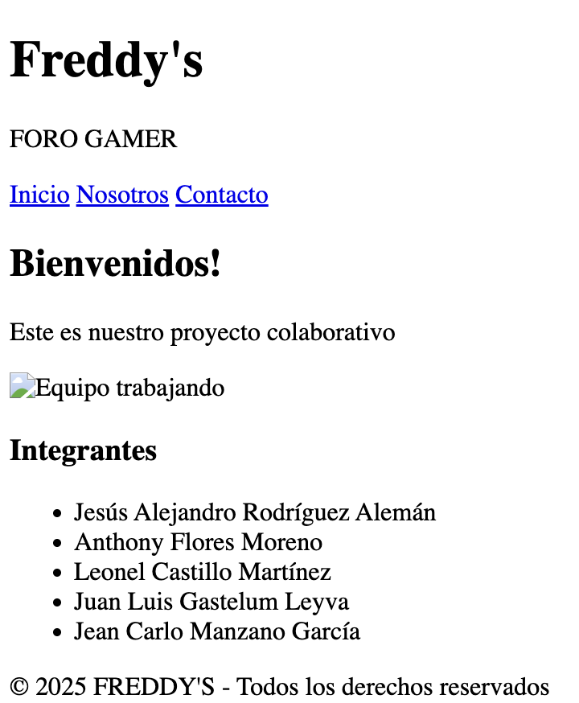

# 🎮 Freddy's Foro Gamer



Sitio web colaborativo estilo gaming desarrollado con HTML5 y CSS3 moderno.

## 🌟 Características
- Diseño gaming responsive
- Efectos hover y animaciones
- Paleta de colores cyberpunk
- Estructura modular
- Compatible con móviles

## 🚀 Instalación
1. Clona el repositorio:
```bash
git clone https://github.com/tu-usuario/freddys-foro-gamer.git


Abre el archivo principal:

bash
Copy
cd freddys-foro-gamer && open index.html


🛠 Estructura del Proyecto
Copy
freddys-foro-gamer/
├── index.html
├── css/
│   └── styles.css
├── img/
│   └── placeholder.jpg
└── README.md

👥 Colaboradores
Integrante	Sección	Contribución
Jesús Alejandro Rodríguez Alemán	Cabecera	Diseño de título y gradientes
Anthony Flores Moreno	Menú	Navegación interactiva
Leonel Castillo Martínez	Contenido Principal	Artículo y grid responsive
Juan Luis Gastelum Leyva	Barra Lateral	Listado de integrantes animado
Jean Carlo Manzano García	Pie de Página	Copyright y efectos especiales


💻 Tecnologías Usadas
HTML5 Semántico
CSS Flexbox/Grid
Gradientes comp